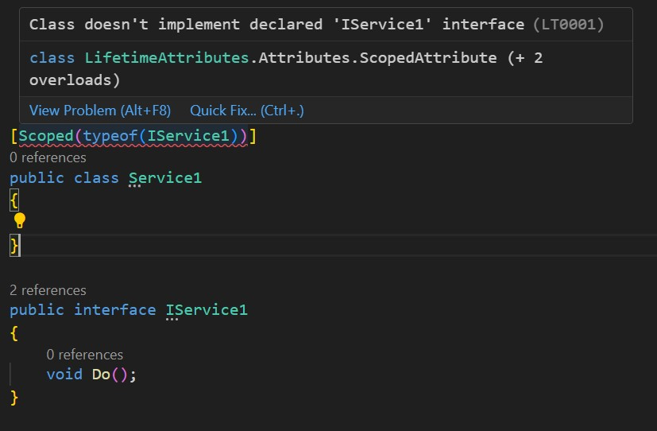

# LifetimeAttributes

This library was created to make service registration into DI container easier. 
Advantages:
- You no longer need to write a long registration code in a separate file ``ServiceCollectionExtensions``.
- It is easy to understand what kind of life cycle the service has

## Plans:

### Functionality

- [x] Attributes of different life cycles

``` cs
[Transient]
public class Service1{}
[Scoped]
public class Service2{}
[Singleton]
public class Service2{}
```

- [x] Registration of tagged services

```cs
serviceCollection.AddServicesWithLifetimeAttribute();
```

### Static analysis:

- [x] Checking the implementation by the class of the interface specified in the attribute

<p align="center">
  
</p>

- [ ] Checking that if the registered class has a Singleton life cycle, so that the infected classes also have such a cycle